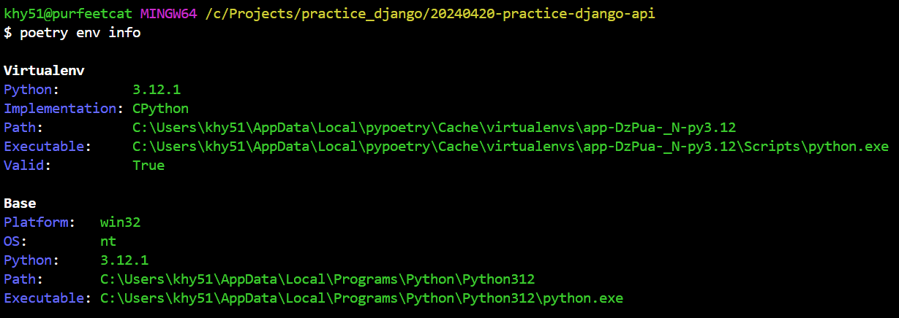

[참고 기사](https://velog.io/@qlgks1/python-poetry-%EC%84%A4%EC%B9%98%EB%B6%80%ED%84%B0-project-initializing-%ED%99%9C%EC%9A%A9%ED%95%98%EA%B8%B0)  


# poetry 프로젝트 시작하기 [링크](https://python-poetry.org/docs/basic-usage/)  

- 포이트리 설치하기  
  - `pip install poetry` - `poetry` 명령어가 실행 안돼는 에러가 발생할수 있지만 가장 쉬운 시작..      
    &darr; `/` &darr; `bash shell`
    ```bash
    pip install poetry
    ```

  - For Mac OS  
    &darr; `/` &darr; `bash shell`

    ```bash
    curl -sSL https://install.python-poetry.org | python3 -
    ```

<br>

- 포이트리 설치 되어있는지 버전 확인  

  &darr; `/` &darr; `bash shell`

  ```bash
  poetry --version
  ```

  <br>

- 포이트리 프로젝트 만들기  
  - poetry new [프로젝트이름] or poetry init  
  - poetry new(폴더 추가하고 폴더안에 기본패키지)  
  - poetry init(현재경로에 toml 파일만 추가하면서, 설정 커스텀 가능)  

  &darr; `/` &darr; `bash shell`
  ```bash
  poetry new app
  ```
  ```bash
  poetry init
  ```

<br>

- 포이트리에 패키지 추가하기  
  - poetry add [패키지명]  

  &darr; `/` &darr; `bash shell`
  ```bash
  poetry add django
  ```

<br>

- 포이트리 가상환겨 활성화  

  &darr; `/` &darr; `bash shell`
  ```bash
  poetry shell
  ```

# 포이트리 오류시 확인사항

- 설치경로 확인하기  
  
  &darr; `/` &darr; `bash shell`
  ```bash
  poetry env info
  ```

    


<br>
